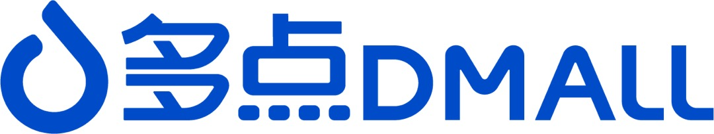

  

    
Run Spark SQL/DataFrame Faster

    
Auron (original name: Blaze) is an accelerator for Apache Spark which leverages native vectorized execution to accelerate SQL/DataFrame queries.

    
<GitHubBadge />

    <a class="route-link auto-link vp-hero-action-button primary" href="/documents/getting-started" aria-label="Get Started">Get Started</a>
  

  

    

      
    

  

  
Key Features

  

    

      

        
        Performance
      

      <ul class="feature-details">
        <li>Supports most native operators/expressions and fine-grained failback.</li>
        <li>Powered by Rust,  <strong class="bold-text">2x faster</strong> on TPC-DS benchmark.</li>
        <li>Performs significantly better in production environments.</li>
      </ul>
    

    

      

        
        Production ready
      

      <ul class="feature-details">
        <li>Verified on production environments with exabytes of data.</li>
        <li>Supports complex production scenarios like JSON parsing, UDF/UDTF, etc.</li>
        <li>Resolved various stability and data consistency issues.</li>
      </ul>
    

    

      

        
        Easy to Use
      

      <ul class="feature-details">
        <li>Simple to build and install to Spark.</li>
        <li>Easy to configuration.</li>
        <li>Full-featured execution metrics.</li>
      </ul>
    

    

      

        
        Compatibility
      

      <ul class="feature-details">
        <li>Adapted to Spark mainline versions.</li>
        <li>Supports different storage systems like HDFS, S3, etc.</li>
      </ul>
    

    

      

        
        Ecosystem
      

      <ul class="feature-details">
        <li>Supports data lake system like Hudi, Paimon.</li>
        <li>Supports Remote Shuffle Service like Apache Celeborn.</li>
      </ul>
    

    

      

        
        Community
      

      <ul class="feature-details">
        <li>Some cooperators have applied Auron on production.</li>
        <li>More are researching and evaluating Auron.</li>
      </ul>
    

  

  
Benchmarks

  

    Auron has passed all TPC-DS/TPC-H benchmark cases. Comparing to Spark-3.5, Auron is running ~2x faster and save ~50% cluster resources.
    See <a href="documents/benchmarks">Benchmark Details</a>.
  

  

    

      
<BenchmarkChart />

    

  

  
Cooperators

  

    Auron currently has some users and contributors. You are invited to join the list by emailing auron@kwai.com.
  

  

    

      

      

      

      

      

      

      

      

      

      

      

      

      

      

      

      

      

      

    

  

