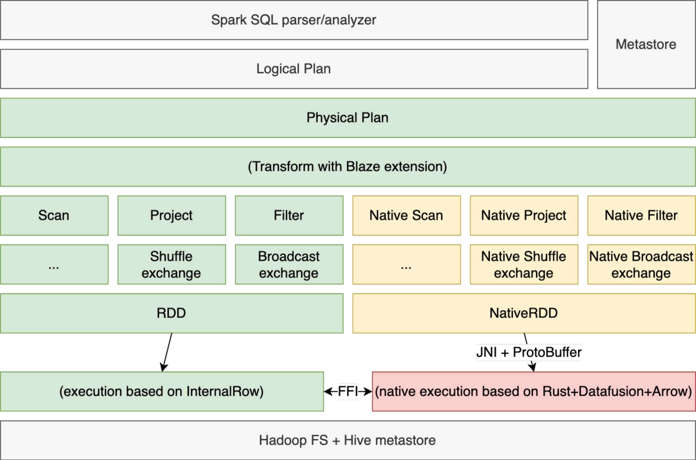

## Overview
The [Blaze](https://github.com/kwai/blaze) accelerator for Apache Spark leverages native vectorized execution to accelerate query processing. It combines the power of the Apache Arrow-DataFusion library and the scale of the Spark distributed computing framework.

## Introduction

### Problem Statement
Apache Spark is a popular distributed computing framework for handling large-scale data processing tasks. However, as the data size increases, traditional row-based processing can lead to significant CPU latencies and become a performance bottleneck. To overcome this challenge, vectorized execution technology has been introduced as an optimization method for Spark. 

### Blaze’s Solution
Vectorized execution technology operates by processing data in batches rather than rows, reducing function calls and improving computation performance with SIMD instructions. Blaze leverages this technology by integrating the Apache Arrow-DataFusion library with the Spark framework.

Blaze checks and translates supported operators in the Spark's physical plan and generates an equivalent native execution plan, then it passes the generated execution plan to the underlying native engine through JNI calls. The native engine executes the plan with DataFusion framework, which benefits from vectorized execution and has better performance comparing to Spark's JVM based execution.

### Target User
Blaze's target users are those who want to accelerate Spark SQL/DataFrame queries. Users can install Blaze as a Spark client extension. After installing, most SQL queries should run faster without modifying, and save cluster resources.

## Architecture
The architecture design of Blaze is as follows.
Blaze takes a fully optimized physical plan from Spark, mapping it into equivalent execution plan implemented in native engine, and executes in Spark distributed environment.

Blaze is composed of the following high-level components:

- **Spark Extension**: hooks the whole accelerator into Spark execution lifetime.
- **Spark Shims**: specialized codes for different versions of spark.
- **Native Engine**: implements the native engine in rust, including:
  - ExecutionPlan protobuf specification.
  - JNI gateway.
  - Customized operators, expressions, functions with DataFusion framework
  - Other common mods like memory management, fallback framework, HDFS-integrating, etc.

The architecture diagram of the **native engine** is as follows:

### Currently Supported Native Operators/Expressions

All supported operators in Blaze are listed below. Blaze does support fallbacking an operator to spark execution which has not been implemented, so SQLs containing unsupported operators can still be executed successfully. However, fallbacks takes extra costs, too many fallbacks will slow down the execution.

Most spark builtin expressions are supported in Blaze (by translating to DataFusion-physical-exprs). Blaze also supports expression-level fallbacking, which can fallback a single unsupported expression to spark execution. so SQLs containing some unsupported expressions like UDF/UDTFs can still be optimized.

<table class="my-table3">
  <tr>
    <th>Native Operator</th>
    <th>Note</th>
  </tr>
  <tr>
    <td>NativeParquetScan</td>
    <td></td>
  </tr>
  <tr>
    <td>NativeParquetInsert</td>
    <td>Some versions of Spark have not been tested. This parameter is disabled by default.</td>
  </tr>
  <tr>
    <td>NativeOrcScan</td>
    <td>The feature is not fully developed and does not support stripe clipping.</td>
  </tr>
  <tr>
    <td>NativeShuffleExchange</td>
    <td>Range partitioning is not supported at the moment.</td>
  </tr>
  <tr>
    <td>NativeBroadcastExchange</td>
    <td></td>
  </tr>
  <tr>
    <td>NativeProject</td>
    <td></td>
  </tr>
  <tr>
    <td>NativeFilter</td>
    <td></td>
  </tr>
  <tr>
    <td>NativeSort</td>
    <td></td>
  </tr>
  <tr>
    <td>NativeLocalLimit</td>
    <td></td>
  </tr>
   <tr>
    <td>NativeGlobalLimit</td>
    <td></td>
  </tr>
  <tr>
    <td>NativeTakeOrdered</td>
    <td></td>
  </tr>
  <tr>
    <td>NativeUnion</td>
    <td></td>
  </tr>
  <tr>
    <td>NativeWindow</td>
    <td>Only the default range [unboundedPreceding, currentRow] is supported.</td>
  </tr>
  <tr>
    <td>NativeExpand</td>
    <td></td>
  </tr>
  <tr>
    <td>NativeGenerate</td>
    <td></td>
  </tr>
  <tr>
    <td>NativeHashAggregate</td>
    <td rowspan="2">UDAF is not supported at the moment.</td>
  </tr>
  <tr>
    <td>NativeSortAggregate</td>
  </tr>
  <tr>
    <td>NativeBroadcastJoin</td>
    <td rowspan="4">Non-equi joins are not supported at the moment.</td> 
  </tr>
  <tr>
    <td>NativeShuffledHashJoin</td>
  </tr>
  <tr>
    <td>NativeSortMergeJoin</td>
  </tr>
  <tr>
    <td>NativeBroadcastNestedLoopJoin</td>
  </tr>
</table>

## Join the Community

### Source Code
Please see [Blaze source code](https://github.com/kwai/blaze) for more information.

### Community
We're using [Discussions](https://github.com/kwai/blaze/discussions) to connect with other members of our community. We hope that you:

- Ask questions you're wondering about.
- Share ideas.
- Engage with other community members.
- Welcome others who are open-minded. Remember that this is a community we build together 💪 .
  
### WeChat Group
We've set up a WeChat group to help Chinese developers communicate more effectively. If you'd like to join, please email us at blaze@kwai.com.
## Performance

Check [Benchmark Results](https://github.com/kwai/blaze/blob/v4.0.0/benchmark-results/20240701-blaze300.md) with the latest date for the performance comparison with vanilla Spark 3.3.3. The benchmark result shows that Blaze save about 50% time on TPC-DS/TPC-H 1TB datasets. Stay tuned and join us for more upcoming thrilling numbers.

## Thanks to our contributors

 

